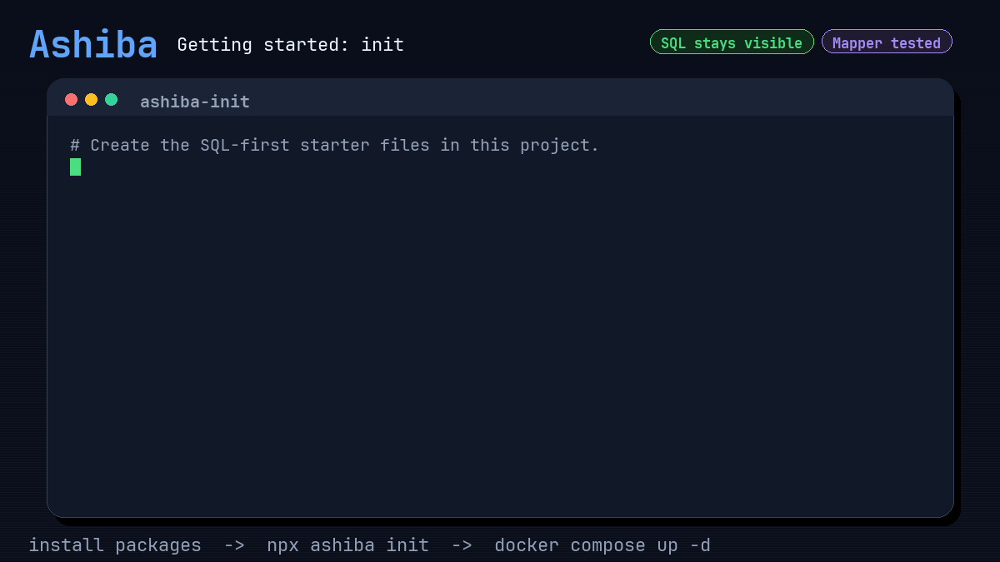
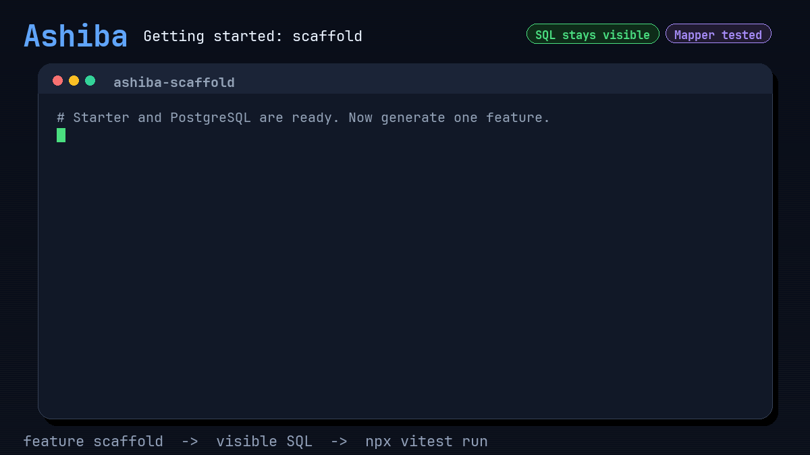
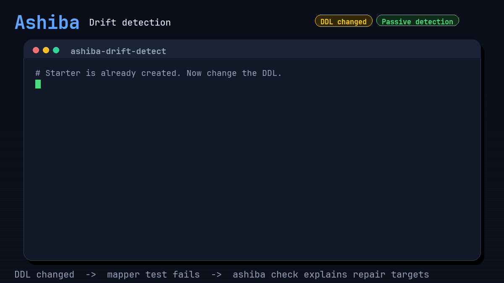
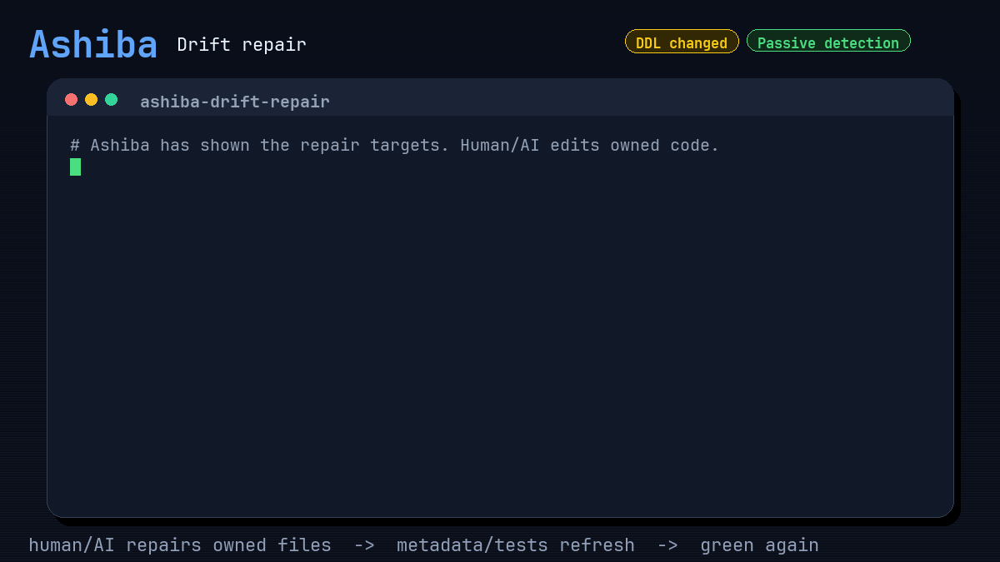
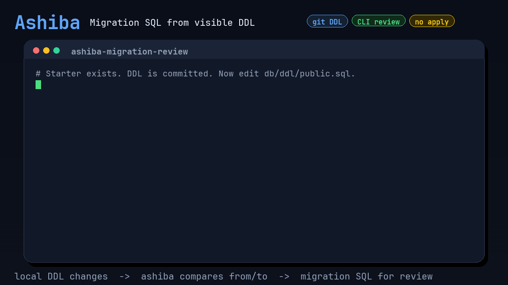

<p align="center">
  
</p>

# Ashiba

Show me the SQL. Ashiba handles the boring parts.

Ashiba is a SQL-first scaffold and verification layer for TypeScript applications. You write the SQL; Ashiba generates DTOs, mapper boundaries, tests, metadata, and drift checks around it.

No ORM runtime. No hidden query DSL. No mapper boilerplate.

<p align="center">
  
</p>

<p align="center">
  
</p>

## Concept

Ashiba is for teams that want SQL to stay visible.

Using SQL should not mean hand-writing every DTO, mapper glue file, test scaffold, and drift check. Ashiba handles that boring work around the SQL.

The SQL is yours. Edit it freely, keep it as application-owned source code, and let Ashiba generate the TypeScript support around it.

Ashiba's generator is not in your runtime path. Your application stays under your control: explicit SQL, a selected thin driver adapter, and ordinary TypeScript.

## Getting Started

The first run should prove the idea quickly:

- create a SQL-first project shape
- start a local PostgreSQL test database
- scaffold a small feature from DDL
- run tests
- see generated TypeScript contracts and mapper-test scaffolds in your repo

Prerequisites:

- Node.js and npm
- Docker with Compose

### 1. Install the PostgreSQL path

```bash
npm install @ashiba-ts/driver-adapter-core @ashiba-ts/driver-adapter-pg pg
npm install -D @ashiba-ts/cli @ashiba-ts/testkit-adapter-pg @types/pg typescript vitest dotenv
```

### 2. Create the starter files

```bash
npx ashiba init --db postgres --driver pg --with-demo-ddl
```

Ashiba creates starter files inside your existing TypeScript project. It does not take over package ownership.

### 3. Start the local test database

```bash
cp .env.example .env
docker compose up -d
```

If port `5432` is busy, change `ASHIBA_TEST_DB_PORT` in `.env`.

### 4. Scaffold a feature from the demo DDL

```bash
npx ashiba feature scaffold users-list --table users --action list
```

This gives you a small SQL-first feature boundary: visible SQL, editable query contracts, generated metadata, mapper boundaries, and test scaffolds.

### 5. Run the checks

```bash
npx vitest run
```

The generated unit tests are mapper tests. They run lightweight DB-backed probes that return representative SQL values and prove those values can map into the TypeScript DTO shape. They do not prove business SQL logic, row counts, final database state, transaction behavior, or which rows should be changed. Put those expectations in customer-owned SQL logic tests when the feature needs them.

At this point, you should have the core Ashiba experience:

- SQL remains visible source code.
- TypeScript DTO and mapper support exists around it.
- Generated assets are reviewable files.
- Tests and checks tell you when the contract drifts.
- Runtime stays ordinary: canonical SQL, a thin SQL execution adapter, and TypeScript application code.

### 6. Change the code

From here, the generated code is yours. Change the SQL, DTO boundary, mapper, or feature code as your application needs.

```bash
# fast local check while editing
npx ashiba check

# full check before push, review, or CI
npx ashiba check --full
```

When DDL and generated contracts drift apart, Ashiba should make the repair path visible: which SQL file changed, which editable TypeScript boundary needs attention, and which generated mapping-test assets can be refreshed.

<p align="center">
  
</p>

<p align="center">
  
</p>

## Supported DBMS And Drivers

Ashiba chooses DBMS and wrapped driver explicitly. PostgreSQL is the most complete path today. MySQL and SQL Server have driver adapters, with starter and testkit coverage still catching up.

| DBMS | Wrapped driver/tool | Package | Current status |
|---|---|---|---|
| Shared driver contracts | driver adapter core | `@ashiba-ts/driver-adapter-core` | Shared feature query contracts, cardinality helpers, and explicit retry-policy helpers. No ORM model or SQL DSL. |
| PostgreSQL | `pg` | `@ashiba-ts/driver-adapter-pg` | Most complete starter path. Includes generated query metadata, mapper-test lane, named-parameter binding, safe sort, optional-condition metadata, transient-error classification, and tutorial coverage. |
| PostgreSQL | `pg` testkit | `@ashiba-ts/testkit-adapter-pg` | ZTD mapper-test adapter used by the PostgreSQL starter. |
| PostgreSQL | `pg_dump` | `@ashiba-ts/ddl-pull-pg-dump` | Optional helper for comparing production DDL from `pg_dump` with local DDL. |
| MySQL | `mysql2` | `@ashiba-ts/driver-adapter-mysql2` | Driver adapter exists. Full `ashiba init` starter and testkit path are not complete yet. |
| SQL Server | `mssql` | `@ashiba-ts/driver-adapter-mssql` | Driver adapter exists. Full `ashiba init` starter and testkit path are not complete yet. |

## Use Cases

Use this section as the entry point for daily work. The command API page links each workflow to the matching CLI surface; use command help and `ashiba describe command --format json` for exact flags and machine-readable descriptors.

| When you want to... | Use this | Details |
|---|---|---|
| Diagnose ordinary drift while editing | `ashiba check` | [Command API](https://mk3008.github.io/ashiba/generated/api/commands#ashiba-check) |
| Run the full local or CI gate | `ashiba check --full` | [Command API](https://mk3008.github.io/ashiba/generated/api/commands#ashiba-check) |
| Scaffold passive gates without hook libraries | `ashiba gate scaffold` | [Command API](https://mk3008.github.io/ashiba/generated/api/commands#ashiba-gate-scaffold) |
| Start a SQL-first TypeScript project shape | `ashiba init` | [Command API](https://mk3008.github.io/ashiba/generated/api/commands#ashiba-init) |
| Generate a feature boundary from an existing DDL table | `ashiba feature scaffold` | [Command API](https://mk3008.github.io/ashiba/generated/api/commands#ashiba-feature-scaffold) |
| Generate a feature boundary from existing SQL | `ashiba feature import <feature> <query> --sql <path>` | [Command API](https://mk3008.github.io/ashiba/generated/api/commands#ashiba-feature-import) |
| Add another query to an existing feature | `ashiba feature query scaffold` | [Command API](https://mk3008.github.io/ashiba/generated/api/commands#ashiba-feature-query-scaffold) |
| Refresh generated metadata after editing SQL | `ashiba feature query refresh` | [Command API](https://mk3008.github.io/ashiba/generated/api/commands#ashiba-feature-query-refresh) |
| Add generated mapper-test cases and human-owned placeholders | `ashiba feature tests scaffold` | [Command API](https://mk3008.github.io/ashiba/generated/api/commands#ashiba-feature-tests-scaffold) |
| Detect generated mapping-test drift | `ashiba feature tests check` | [Command API](https://mk3008.github.io/ashiba/generated/api/commands#ashiba-feature-tests-check) |
| Check SQL parameters, result columns, and editable query contracts | `ashiba feature generated-mapper check` | [Command API](https://mk3008.github.io/ashiba/generated/api/commands#ashiba-feature-generated-mapper-check) |
| Run the project-level passive check gate | `ashiba project check` | [Command API](https://mk3008.github.io/ashiba/generated/api/commands#ashiba-project-check) |
| Check visible SQL contracts before commit or release | `ashiba check-contract` | [Command API](https://mk3008.github.io/ashiba/generated/api/commands#ashiba-check-contract) |
| Generate reviewable migration SQL from DDL changes | `ashiba ddl migration generate` | [Command API](https://mk3008.github.io/ashiba/generated/api/commands#ashiba-ddl-migration-generate) |
| Run SQL lint and DDL-aware checks | `ashiba lint <path>` | [Command API](https://mk3008.github.io/ashiba/generated/api/commands#ashiba-lint) |
| Inspect, visualize, or debug complex SQL | `ashiba query outline <sqlFile>`, `ashiba query graph <sqlFile>`, `ashiba query slice <sqlFile>` | [Command API](https://mk3008.github.io/ashiba/generated/api/commands#ashiba-query) |
| Format SQL explicitly after safety checks pass | `ashiba query format <sqlFile>`, `ashiba query format --all` | [SQL format](docs/guide/sql-format.md), [Command API](https://mk3008.github.io/ashiba/generated/api/commands#ashiba-query-format) |
| Find SQL assets that reference a table or column | `ashiba query uses table <target>`, `ashiba query uses column <target>` | [Command API](https://mk3008.github.io/ashiba/generated/api/commands#ashiba-query-uses) |
| Maintain SSSQL optional-search metadata | `ashiba query optional add <sqlFile>`, `ashiba query optional refresh <sqlFile>`, `ashiba query optional remove <sqlFile>` | [SSSQL notation](docs/guide/sssql.md), [Command API](https://mk3008.github.io/ashiba/generated/api/commands#ashiba-query-optional) |
| Add dynamic ORDER BY without accepting raw SQL fragments | Safe sort | [Safe sort](docs/guide/safe-sort.md), [Command API](https://mk3008.github.io/ashiba/generated/api/driver-adapter-core/src/type-aliases/AshibaSortInput) |
| Generate editable query contracts from a SQL file | `ashiba model-gen <sqlFile>` | [Command API](https://mk3008.github.io/ashiba/generated/api/commands#ashiba-model-gen) |
| Capture DB-backed performance evidence | `ashiba perf scenario init`, `ashiba perf scenario measure` | [Command API](https://mk3008.github.io/ashiba/generated/api/commands#ashiba-perf-scenario) |
| Inspect review-first feature and query boundaries | `ashiba rfba inspect` | [Command API](https://mk3008.github.io/ashiba/generated/api/commands#ashiba-rfba-inspect) |

## Typical Loops

### I changed SQL

```bash
npx ashiba feature query refresh users-list list
npx ashiba check
npx ashiba check --full
```

Use this when the SQL changed but the feature boundary should remain the same.

### I changed DDL

```bash
npx ashiba check
npx ashiba ddl migration generate --from-dir path/to/old-ddl --to-dir db/ddl --out tmp/ddl/migration.sql
```

Use this when schema source changed and you want drift signals plus reviewable migration SQL.

### I want passive gates

```bash
npx ashiba gate scaffold
```

This creates the shared `ashiba:check` / `ashiba:verify` package scripts, a GitHub Actions workflow, and a native pre-push hook file. Ashiba does not require Husky for this path.

### I need to know what a table change will touch

```bash
npx ashiba query uses table users
npx ashiba query uses column users.email
```

Use this before changing or removing schema objects.

### I need to understand a large SQL file

```bash
npx ashiba query outline path/to/query.sql
npx ashiba query graph path/to/query.sql
npx ashiba query slice path/to/query.sql
```

Use this when SQL review needs structure, dependencies, or focused slices.

### I want migration SQL, but not migration ownership

```bash
npx ashiba ddl migration generate \
  --from-git main:db/ddl \
  --to-dir db/ddl \
  --out tmp/ddl/migration.sql \
  --no-drop-tables \
  --no-drop-columns \
  --no-drop-constraints \
  --format json > tmp/ddl/migration-report.json
```

Ashiba writes migration SQL to `--out` and prints a JSON review report with summary, apply plan, and risks. Your application or operator process still owns DB connection, migration apply, rollback policy, and deployment timing.

<p align="center">
  
</p>

## Configuration

Ashiba reads `ashiba.config.json`:

```json
{
  "$schema": "https://ashiba.dev/schema/ashiba-config.json",
  "featureRoot": "src/features",
  "sqlRoots": ["src/features"],
  "ddl": {
    "sourceDir": "db/ddl"
  },
  "sql": {
    "parameterStyle": "both"
  },
  "tests": {
    "mapperLane": "ztd",
    "performanceLane": "traditional"
  }
}
```

`featureRoot` is the generated feature or use-case boundary root.

`sqlRoots` is the passive SQL check surface. Add shared SQL folders there when SQL lives outside features.

Print a starter config with:

```bash
npx ashiba config
```

## Runtime Boundary

Ashiba is not an ORM runtime or SQL DSL. The CLI generator, SQL analysis, scaffolding, tests, and drift checks are development-time tools.

At runtime, applications may use a selected thin SQL execution adapter such as `@ashiba-ts/driver-adapter-pg`. That adapter owns narrow execution concerns: named-parameter binding, metadata-backed optional-condition compression, metadata-backed safe sort, stale metadata rejection, observer events, and transient-error classification for explicit retry policies. It does not own entities, relations, lazy loading, unit of work, dirty tracking, query planning, hidden automatic retry, or SAGA compensation.

The `.sql` file is the canonical source. Generated `query.sql.ts` is a runtime snapshot and must not be hand edited. After SQL-only edits, run refresh/check so `.sql`, `query.sql.ts`, and `query.meta.ts` stay synchronized.

See [Runtime boundary](docs/guide/runtime-boundary.md) for the exact wording and safety boundary.

## Command API

Use the command API page, command help, and machine-readable command descriptors for exact CLI usage:

```bash
npx ashiba --help
npx ashiba <command> --help
npx ashiba describe command --format json
```

The README explains where to start. Command help and `ashiba describe command --format json` are the source of truth for exact flags, JSON output, and command-specific behavior.

## Further Reading

- [Command API](https://mk3008.github.io/ashiba/generated/api/commands)

## Development

Run the local acceptance gate:

```bash
pnpm verify
```

Useful narrower checks:

```bash
pnpm docs:build
pnpm verify:customer-tutorial
pnpm verify:customer-tutorial:docker
pnpm docs:dev
```

## License

MIT
