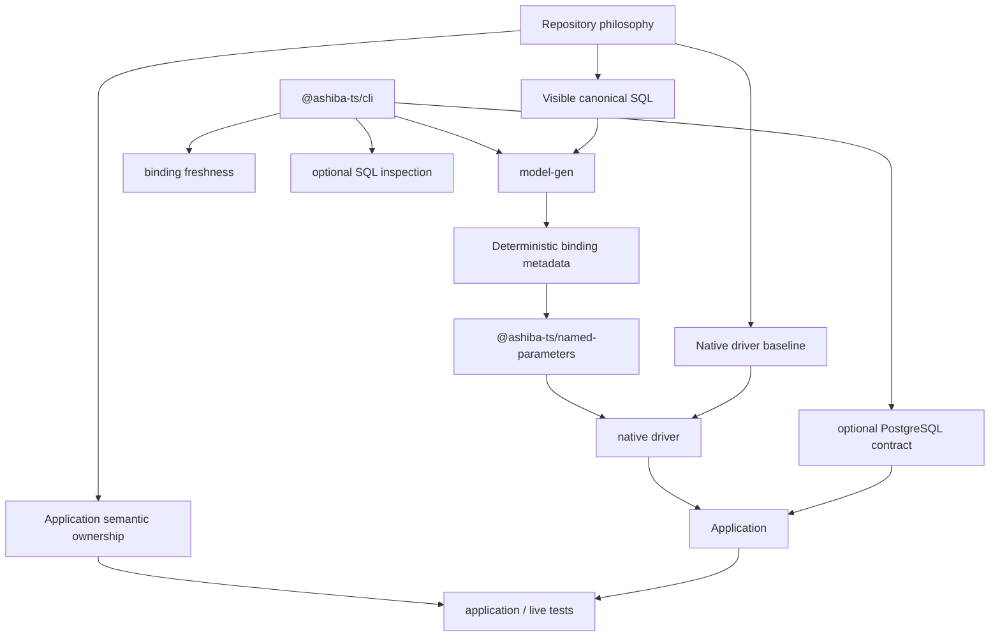

# Concept Map

This page is the current-product review index for Ashiba. It records the
responsibilities Ashiba owns today; historical evaluations and migration notes
preserve removed surfaces separately.

## Product and Provenance

- Product: `Ashiba`
- Historical origin: the `rawsql-ts` work that Ashiba was rebranded from
- CLI package: `@ashiba-ts/cli`
- CLI command: `ashiba`

The current Golden Path is:

```text
canonical SQL
→ deterministic binding metadata
→ bindNamedParameters
→ native driver
→ optional PostgreSQL contract
→ application/live tests
```

## Package Responsibility Categories

| Category | Package area | Current responsibility |
|---|---|---|
| Repository philosophy | Repository-wide concepts and policies | Keeps SQL visible and defines the native-driver and application-ownership boundaries. |
| SQL tooling and verification | `@ashiba-ts/cli` | Generates deterministic binding artifacts, checks their freshness, provides optional PostgreSQL contract commands, and exposes retained SQL inspection tooling. |
| Binding package | `@ashiba-ts/named-parameters` | Provides deterministic parameter handling; native drivers remain execution owners. |
| Optional SQL tooling | Retained CLI and package capabilities | Provides explicit query inspection, DDL-backed lint, resource comparison, contract, and metadata assistance only where that capability is currently retained. |

## Customer Contact Review Lanes

| Contact surface | Review focus | Why it matters |
|---|---|---|
| Product, package, CLI, and docs | Commands, help, package boundaries, and SQL-first guidance | A user must be able to discover the supported path without learning hidden product conventions. |
| Generated deterministic artifacts | Binding metadata and optional contract or retained metadata artifacts | Artifacts must be source-derived, reviewable, freshness-checked where applicable, and never hide application values in SQL text. |
| Application integration boundary | Native driver use, application types, transactions, and semantic tests | Applications retain responsibility for behavior, database state, rollback policy, and live proof. |

## Repository Philosophy Concepts

| ID | Display name | Status | Notes |
|---|---|---|---|
| `ashiba` | Ashiba | mostly done | SQL-first tooling and verification product. PostgreSQL is the primary evidence path; MySQL and SQL Server remain supported secondary DBMS targets. |
| `visible-sql` | Visible SQL | mostly done | Canonical SQL remains readable, reviewable, editable, executable, and searchable. Application values use meaningful named parameters. |
| `boring-mechanical-boundaries` | Boring Mechanical Boundaries | mostly done | Ashiba owns deterministic named-parameter lowering, binding metadata, freshness, missing/unused parameter rejection, and optional DB-derived contract facts. |
| `runtime-boundary` | Native Driver Baseline | mostly done | Ashiba tooling is not the runtime execution owner. Applications bind values and call native drivers directly. |
| `no-orm-runtime` | No ORM Runtime | mostly done | Ashiba does not own entities, relation loading, unit-of-work tracking, transaction policy, or application architecture. |
| `no-query-dsl-ceremony` | No Query DSL Ceremony | mostly done | SQL remains ordinary dialect SQL without Ashiba-only directives or runtime rewriting. |
| `deterministic-generated-metadata` | Deterministic Generated Metadata | mostly done | Binding metadata and optional retained metadata are source-derived development artifacts, distinct from application source architecture. |
| `passive-failure-surface` | Passive Failure Surface | partial | Ordinary checks should expose invalid canonical SQL, stale binding metadata, and stale optional contract facts with a clear cause and recovery action. |
| `application-semantic-ownership` | Application Semantic Ownership | mostly done | Applications own business behavior, result shaping, transactions, rollback policy, migration application, and physical database, integration, or live tests. |
| `no-ai-behavior-file-distribution` | No AI Behavior File Distribution | mostly done | Ashiba does not distribute `AGENTS.md`, `SKILL.md`, skills, prompts, or other AI-agent behavior files. |
| `tooling-ast-dependency-policy` | Tooling AST Dependency Policy | partial | Development tooling may use tested SQL AST APIs. Structural analysis must not silently fall back to unsafe parsing. |
| `file-backed-runtime-sql` | Canonical SQL Text At Runtime | partial | Canonical SQL is normally file-backed for review and tooling, while runtime integration may receive application-supplied SQL text and provenance without requiring `node:fs`. |
| `public-api-and-help-surface` | Public API and Help Surface | partial | Public exports require documentation and CLI commands require discoverable help. |
| `human-first-command-interface` | Human-First Command Interface | partial | The ordinary diagnostic path should be small, discoverable, explicit about effects, and safe for people and AI agents to use. |
| `cli-dry-run` | CLI Dry Run | partial | Mutating CLI commands must expose a preview that reports planned effects without changing files or external state. |

## CLI Concepts

| ID | Display name | Status | Notes |
|---|---|---|---|
| `binding-artifact-generation` | Binding Artifact Generation | mostly done | `model-gen` produces deterministic DBMS-specific binding artifacts from canonical SQL. |
| `binding-artifact-freshness` | Binding Artifact Freshness | mostly done | `model-gen --check` verifies that a checked-in binding artifact still matches canonical SQL. |
| `postgresql-contract` | Optional PostgreSQL Contract | mostly done | Explicit commands compare application-declared parameter/result types with real PostgreSQL and default `pg` representations. It is mechanical proof, not a SQL logic-test framework. |
| `application-owned-sql-tests` | Application-Owned SQL Tests | mostly done | SQL business logic, database state, transaction isolation, locking, and mutation correctness belong to physical database, integration, or live tests owned by the application. |
| `deterministic-sql-inspection` | Deterministic SQL Inspection | mostly done | Retained AST-first query uses, DDL-backed lint, and resource comparison remain explicit SQL tooling rather than an execution architecture. |
| `cli-no-hidden-sql-rewrite` | CLI No Hidden SQL Rewrite | mostly done | CLI tooling does not interpolate application values or conceal runtime SQL rewriting in application execution. |

## Binding Concepts

These concepts belong to the driver-neutral binding library. SQL semantic proof
and runtime integration remain application-owned.

| ID | Display name | Status | Notes |
|---|---|---|---|
| `named-parameter-binding` | Named Parameter Binding | mostly done | Canonical `:name` or ecosystem-native named parameters lower deterministically to driver placeholders and a separate value representation. |
| `parameter-contract-check` | Parameter Contract Check | mostly done | The binder rejects missing and unused parameters before execution. |

## Category Relationship View



## Review Checks

- Canonical SQL remains visible, ordinary dialect SQL, and free of proprietary directives.
- Parameter lowering preserves parameterized execution: values remain separate from SQL text through the driver boundary.
- Binding artifacts are deterministic and freshness checks cover the artifacts Ashiba generates.
- Missing and unused parameters fail before execution.
- Optional PostgreSQL contracts are explicitly invoked mechanical proof; they do not replace application semantic tests.
- Native drivers remain the execution owners. Applications own pools, logging, transactions, optional query variants, and finite sort mappings.
- Application behavior, result shaping, transactions, rollback policy, migration application, and SQL semantic proof remain application-owned.
- Ashiba does not prescribe application architecture, directory layout, or an application testing framework.
- Public package, CLI, docs, and generated deterministic artifact surfaces must not promise removed application-generation or test-framework behavior.
